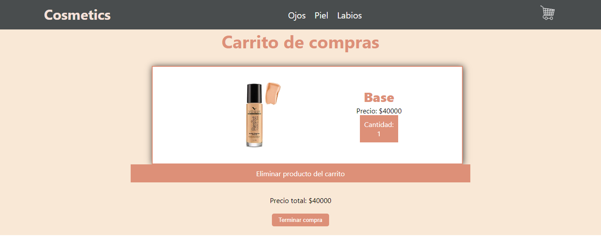
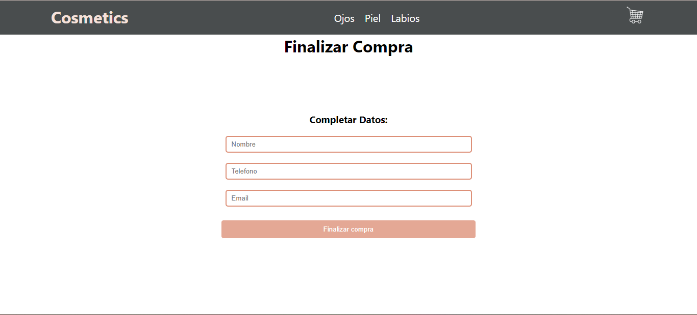

<h1>E-Commerce de cosmeticos</h1>

    </img>

<h2>Resumen</h2>

    El e-commerce cuenta con una vista de los productos que contiene, al dar click en "Ver Detalle" se dirige a los detalles del producto y se direcciona segun el id del mismo, dontro de estos detalles se enciantan diferentes opciones y la opcion de terminar compra que dirije al carrito de compras.

    </img>

    Cuenta con un nav horizontal donde se puede navegar segun la categoria del producto (ojos, piel y labios), se filtran segun la opcion que el usuario escoja.

<h2>Detalles</h2>
<ul>
<li>Menu de opciones</li>

    Cuenta con el nombre del sitio web que al dar click encima direcciona al inicio, las opciones y un icono de carrito de compras que guarda los productos que se van seleccionando, en cuanto a los estilos se realizaron por medio de CSS.

<li>Inicio</li>

    En el innicio, se encuentran cuatro tarjetas donde cada una de ellas contiene los productos, tienen un titulo donde se encuentra el nombre del producto seguido de una imagen, el precio y finalmente un boton de ver mas detalles, los estilos se relizaron por medio de CSS.

    Se realizo una promesa con un arreglo "productos" que posee tres objetos con las keys y los values que corresponden dependiendo del producto y se llamaron hacia la tarjeta, tambien se uso un hook de efecto para que funcione como filtro.

<li>Detalles del Producto</li>

    Al ver los detalles del producto se obseva la imagen de este y al lado la informacion correspondiente, los estilos que posee se realizaron mediante CSS, para direccionar a cada uno se hizo por medio de el id utilizando useParams de react-router-dom y se filtra por parametro.

    Se relizo un botón contador para agregar el producto, este debe incrementar según el stock en este caso el stock pata todos los productos es 5 y tambien debe decrementar hasta 0.

<li>Crrito de compras</li>

    La vista es de los productos seleccionados, se muestra la imagen del producto, el titulo, el precio , la cantidad seleccionados y debajo un boton disponible por si el usurio quiere eliminar un prtoducto.

    </img>

    Despues, se observa el precio total y un boton de teminar compra, que este direcciona a un formulario que es el ultimo paso para finalizar la compra.

    </img>

</ul>

<h2>Direccionamiento de rutas</h2>

<ul>
<li>/</li>

    Direcciona a ItemListContainer, alli es donde se encuentran los productos que contiene el e-commerce.

<li>/categoria/:id</li>

    Direcciona a ItemListContainer, alli es donde se encuentran los productos que contiene el e-commerce.

<li>/item/:id</li>

    Direcciona a ItemDetailContainer, alli es donde se encuentran los detalles de los productos que contiene el e-commerce.

<li>Funcionamiento del sitio web</li>

</ul>